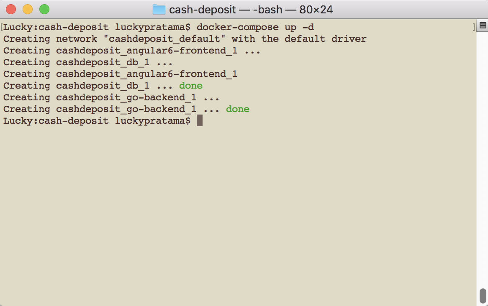
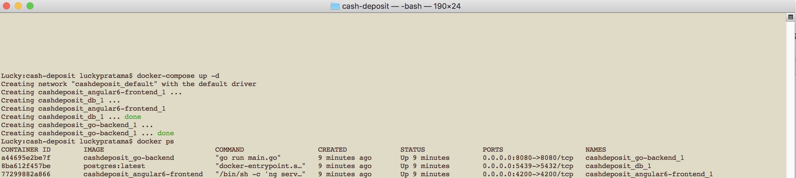
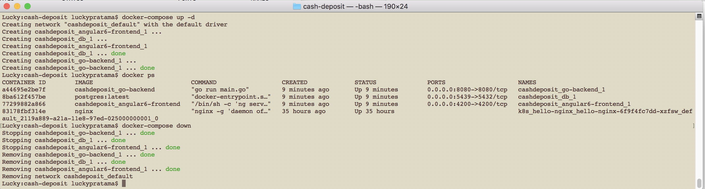

<h1> Cash Deposit App with Go, Apache Kafka, Angular 6, PostgreSQL, and Docker </h1>

<h3>Steps to Run and Stop the Program</h3>

1. Run <strong>docker-compose up -d</strong> command in cash-deposit root directory

If everything goes well, the command will create and run cash-deposit with angular6-frontend and go-docker tags images as well as run postgres image below:
 

2. Now you may check that those three app are running in docker container

3. To stop and remove those three running containers, you could simply run <strong>docker-compose down</strong>

<h3> Use Cases: </h3>
<h4>Customer:</h4>

1. Customer accesses website via browser to deposit

2. Web browser makes request to the frontend app (Angular 6)

3. Frontend app makes request to the backend (Golang) by invoking the backend's RESTful web service

4. Web service (Kafka Producer) send data to the Kafka's topic (cash_deposit)

5. Kafka Consumer get data from Kafka's topic (cash_deposit) as well as sending data to the DB and mail via SMTP

6. DB send response data

7.  Web service receive response data from DB and pass data to the frontend.

<h4>Bank Officer:</h4>

1. Bank officer accesses website via browser to get the transaction history of all customers or the related customer only

2. Web browser makes request to the frontend app (Angular 6)

3. Frontend app makes request to the backend (Golang) by invoking the backend's RESTful web service

4. Web service send request to DB

5. DB send response data

6. Web service receive response data from DB and pass data to the frontend.

