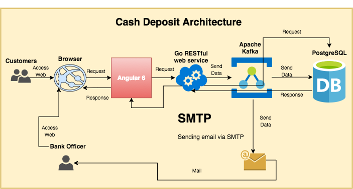

<h1> Cash Deposit App with Go, Apache Kafka, Angular 6, PostgreSQL, and Docker </h1>

<h3> Use Cases: </h3>
<h4>Customer:</h4>

1. Customer accesses website via browser to deposit

2. Web browser makes request to the frontend app (Angular 6)

3. Frontend app makes request to the backend (Golang) by invoking the backend's RESTful web service

4. Web service (Kafka Producer) send data to the Kafka's topic (cash_deposit)

5. Kafka Consumer get data from Kafka's topic (cash_deposit) as well as sending data to the DB and mail via SMTP

6. DB send response data

7.  Web service receive response data from DB and pass data to the frontend.

<h4>Bank Officer:</h4>

1. Bank officer accesses website via browser to get the transaction history of all customers or the related customer only

2. Web browser makes request to the frontend app (Angular 6)

3. Frontend app makes request to the backend (Golang) by invoking the backend's RESTful web service

4. Web service send request to DB

5. DB send response data

6. Web service receive response data from DB and pass data to the frontend.

