# Angular6-Frontend

### Before run the application you need run "npm install" to get all dependencies needed in the root directory of this angular6-frontend app then just enter command "ng serve" in your terminal and the app is running in port 4200.

### Prerequisite:
1. Angular 6
2. Angular Material
3. Angular CDK

### Sample UI
#### User Registration 1:

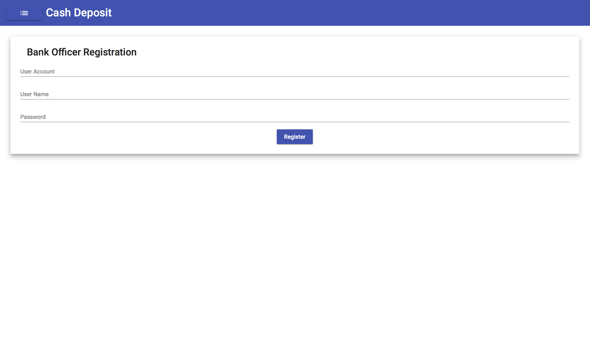

#### User Registration 2:

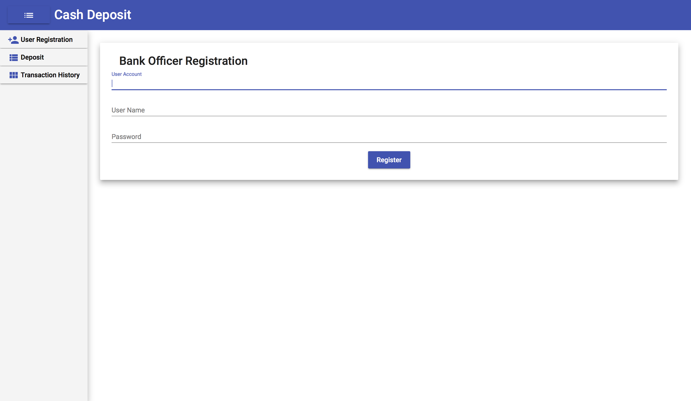

#### Deposit 1:

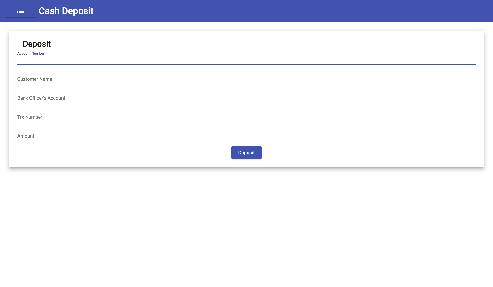

#### Deposit 2:

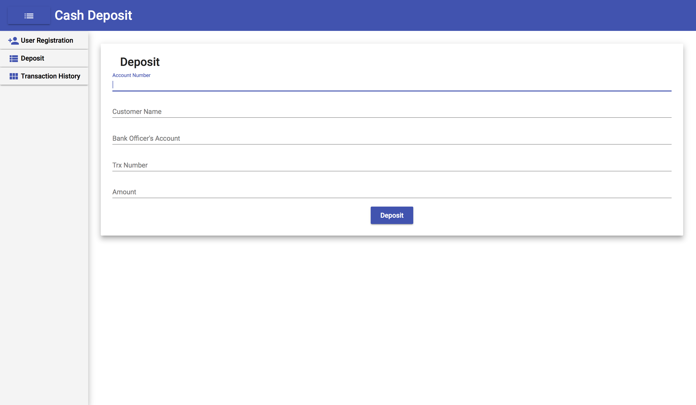

#### Deposit 3:

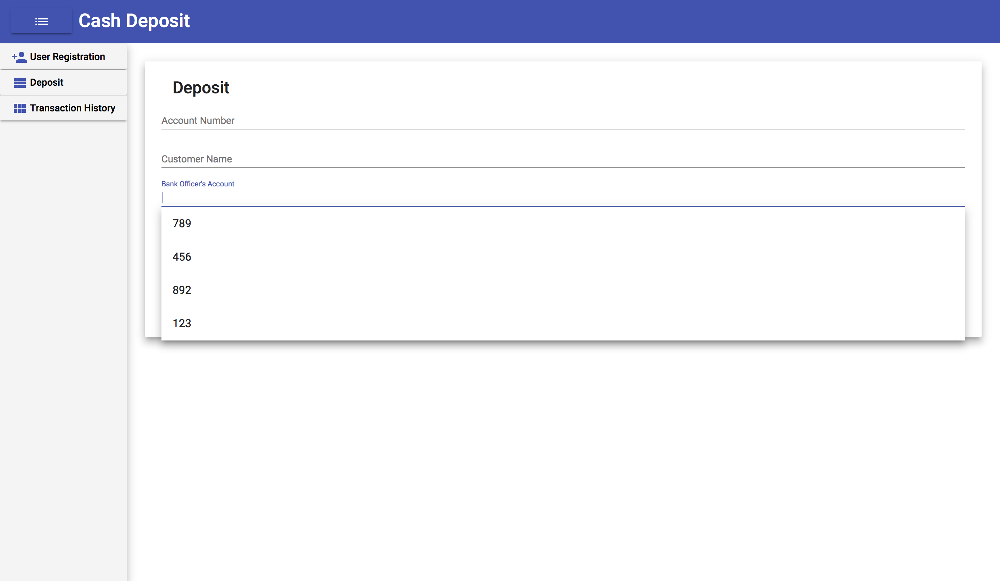

#### Transaction History 1:

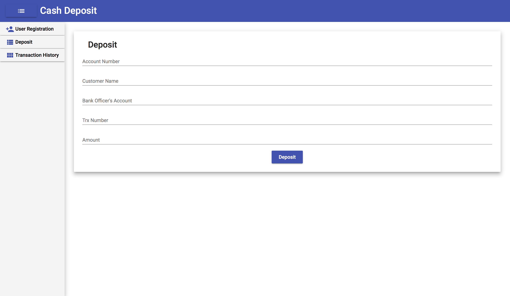

#### Transaction History 2:

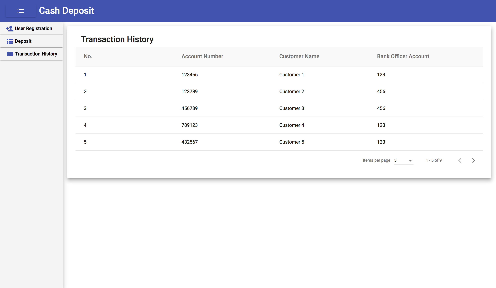

#### Transaction History 3:

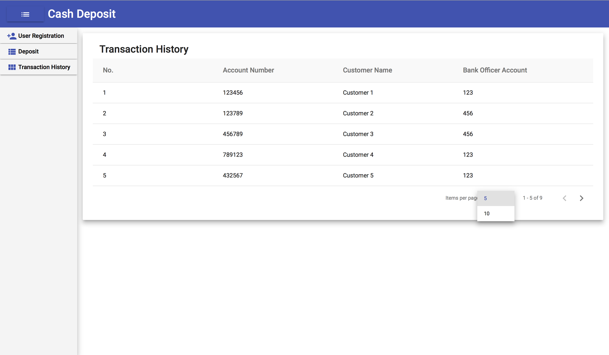

#### Transaction History 4:

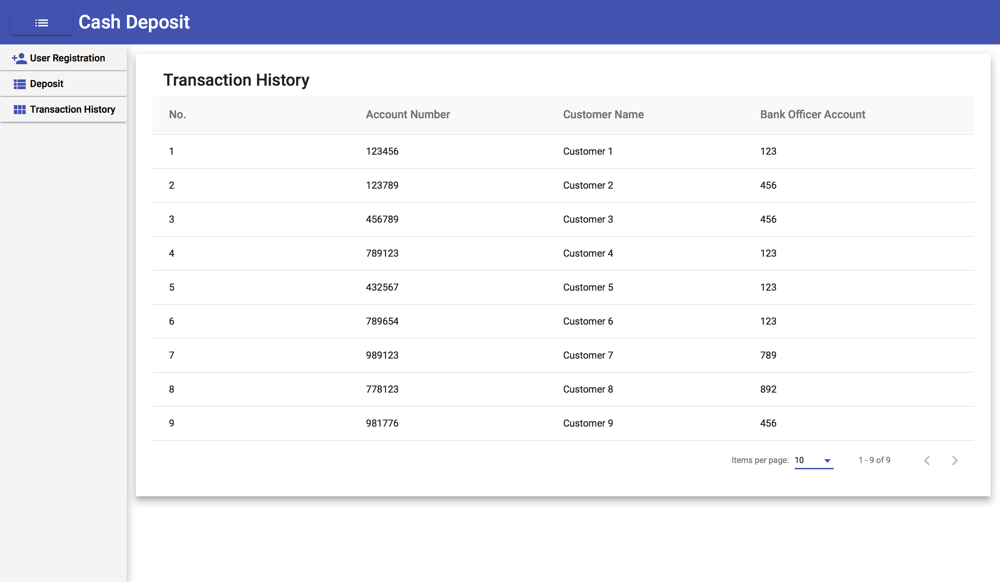

#### Transaction History 5:

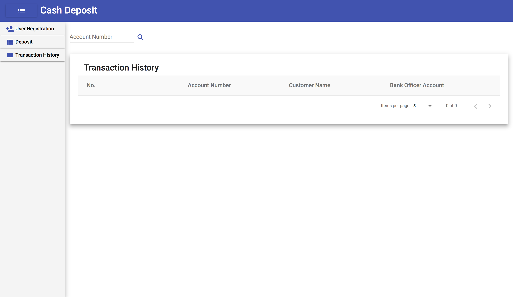

#### Transaction History 6:

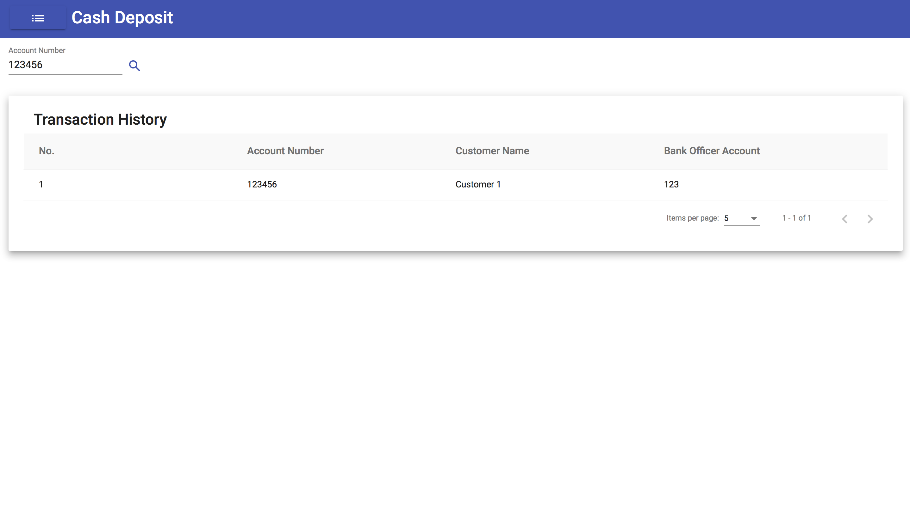

#### Transaction History 7:

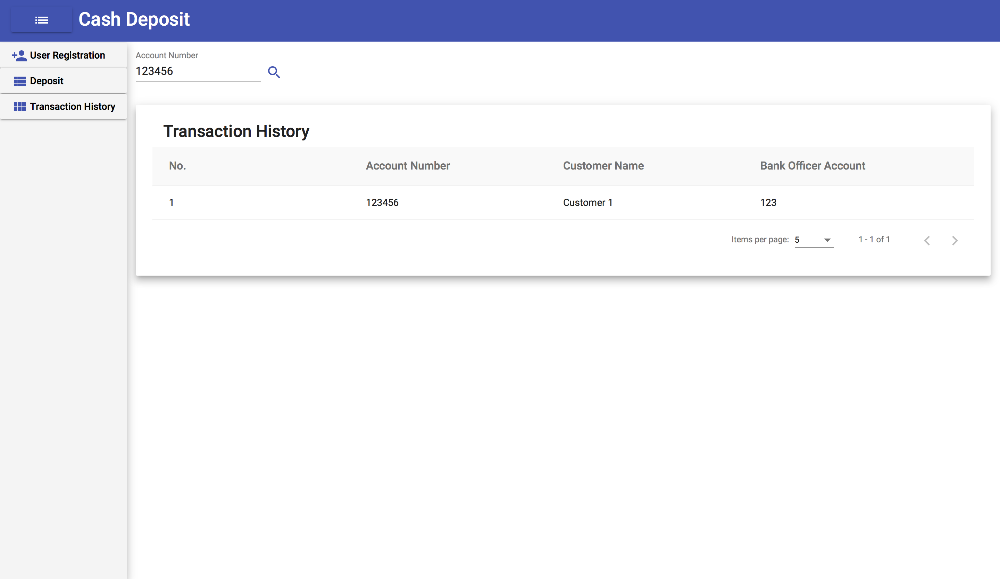

#### Transaction History 8:

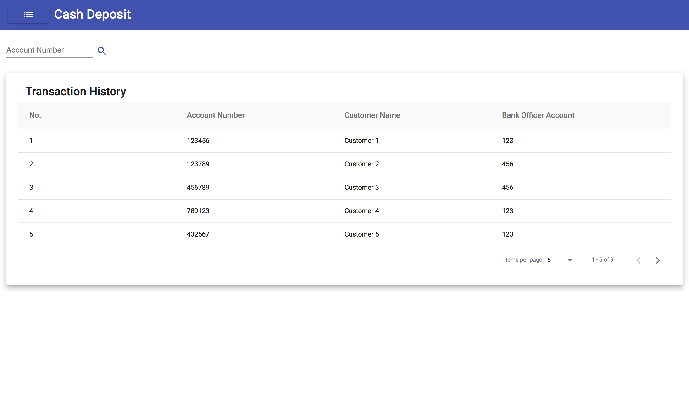

#### Transaction Detail:

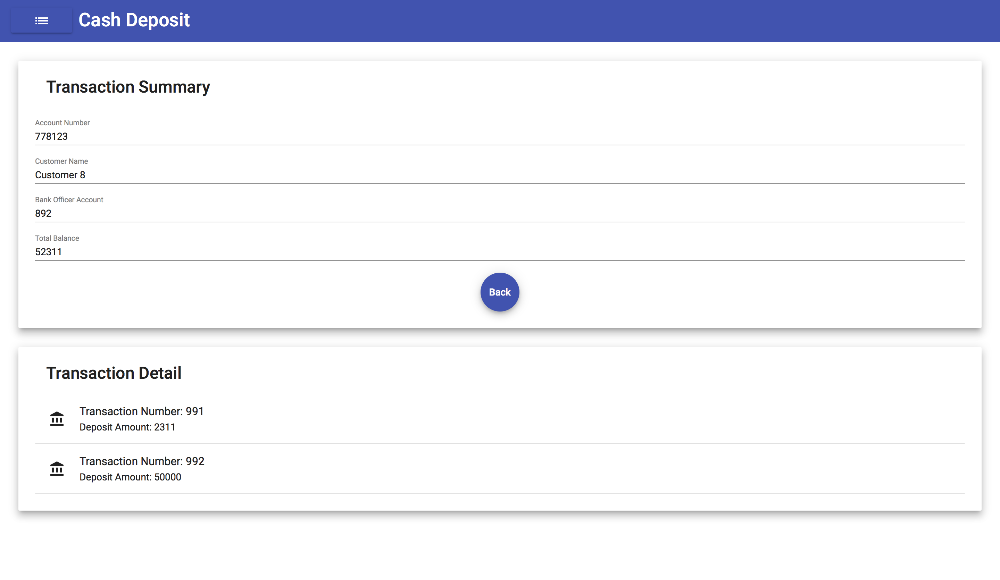

