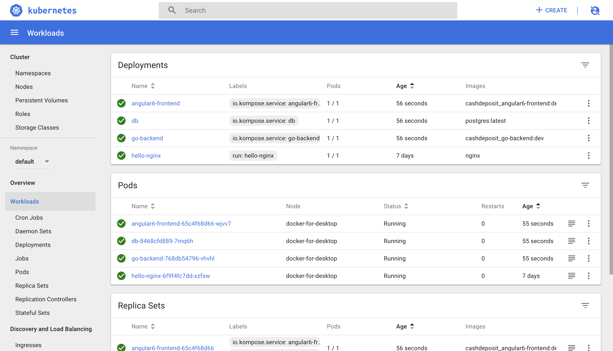
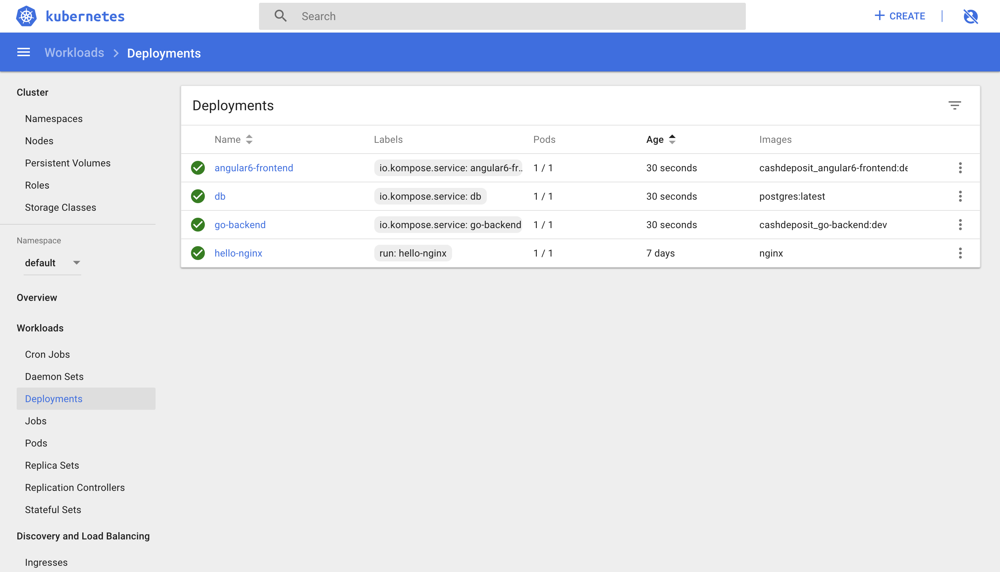
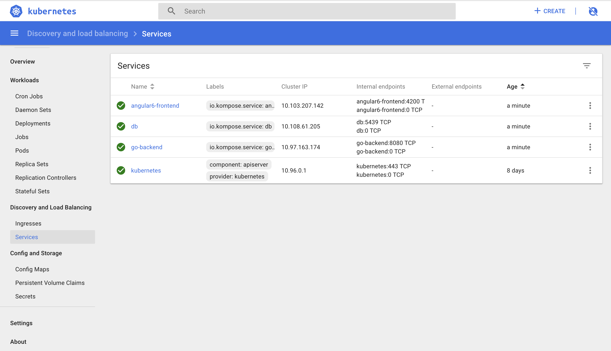

<h1>Deploy postgres, angular6-frontend, and go-backend containers to Kubernetes</h1>

<h3>Steps to Run and Stop the Program</h3>

1. Run step 1 until 3 <a href="../README.md">here</a>

2. Run <strong>kubectl proxy</strong> command

3. Run <strong>kompose convert -f docker-compose.yml -o cash-deposit.yml</strong> command inside root directory (/cash-deposit)

4. Run <strong>kubectl create -f cash-deposit.yml</strong> command inside root directory (/cash-deposit)

If everything goes well, the command will deploy cashdeposit_angular6-frontend, cashdeposit_go-docker, and cashdeposit_db containers to Kubernetes. You may check the deployment on Kubernetes Dashboard here: 
<a href="http://localhost:8001/api/v1/namespaces/kube-system/services/https:kubernetes-dashboard:/proxy/#!/login">
http://localhost:8001/api/v1/namespaces/kube-system/services/https:kubernetes-dashboard:/proxy/#!/login</a>
 
<h3>Dashboard 1</h3>

<h3>Dashboard 2</h3>

<h3>Dashboard 3</h3>

